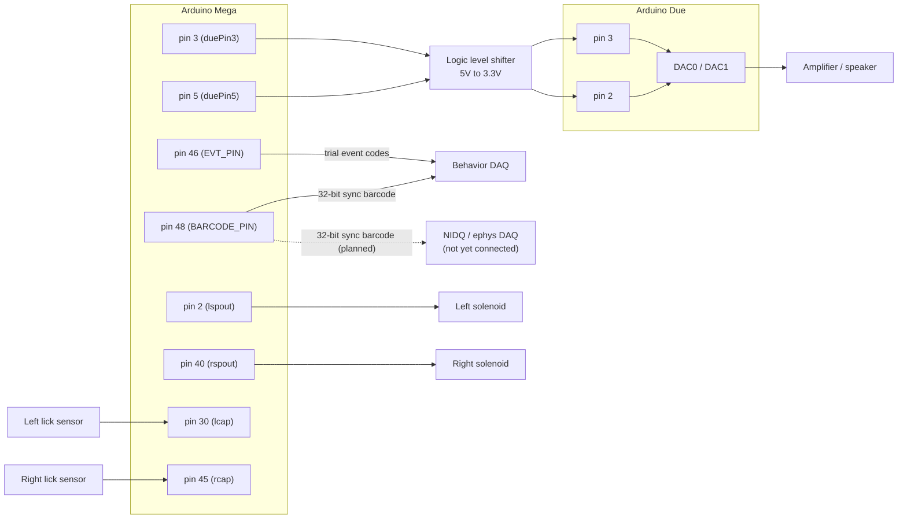

# VR Task Arduino Sketch

Arduino Mega sketch (`VR_Taskv_PreCue_WN_DelayAdded_3Lick.ino`) controlling a VR behavioral task: reads left/right lick sensors, drives reward solenoids and a spout-positioning servo, plays audio cues, and reports trial outcomes back over serial.

This version updates the pin mapping to match new wiring, and moves audio generation off the Mega onto a companion Arduino Due that does the actual tone/white-noise synthesis.

## Changelog

| Type | Item | Detail |
|---|---|---|
| Changed | `lcap` (left lick sensor) | 28 → 30 |
| Changed | `rcap` (right lick sensor) | 30 → 45 |
| Changed | `lspout` (left solenoid) | 40 → 2 |
| Changed | `rspout` (right solenoid) | 38 → 40 |
| Changed | `CueFunc()` | Cue trigger calls `SetSoundState(SND_TONE_A/B)` instead of `tone(audioamp, ...)`; cue-end calls `SetSoundState(SND_IDLE)` |
| Changed | `GiveReward()` | Reward cue (`rewardcuedur`, `'G'` trials) calls `StartSound(...)` instead of `tone(audioamp, ...)` |
| Changed | `SerialInfo()` pre-cue (`buf[4]=='H'`/`'T'`) | Calls `StartSound(SND_TONE_B/A, precuedur)` instead of `tone(audioamp, ...)` — non-blocking, so toggle/serial stay responsive |
| Changed | `WhiteNoise()` / `FalseAlarm()` noise burst | Call `PlayWhiteNoiseBlocking(noisedur)` instead of the manual LFSR bit-bang loop |
| Changed | `FalseAlarm()` penalty | `delay(falseAlarmTimeout)` replaced with a non-blocking `millis()` timer; default shortened 5000ms → 2000ms |
| Changed | pin 46 | Was `toneOut` (simple cue-playing flag) → now `EVT_PIN` (pulse-count trial event codes) |
| Added | `duePin3`, `duePin5` (pins 3, 5) | 2-bit sound-state signal to the Due |
| Added | `SetSoundState()`, `StartSound()`, `SoundTimerFunc()`, `PlayWhiteNoiseBlocking()` | Due sound-signaling helpers |
| Added | `EVT_PIN` (46) + `QueueEvent()` / `EvtFunc()` | Non-blocking, queued pulse-count event codes to the behavior DAQ |
| Added | `BARCODE_PIN` (48) + `BarcodeFunc()` | Non-blocking 32-bit sync barcode, every 30s, currently wired to the behavior DAQ (NIDQ leg planned, not yet connected) |
| Removed | `audioamp` (old pin 3) | Replaced by `duePin3`/`duePin5` |
| Removed | `generateNoise()`, `LFSR_INIT`, `LFSR_MASK` | On-Mega noise synthesis deleted — the Due generates noise now |
| Removed | All `tone(audioamp, ...)` calls | In `CueFunc()`, `GiveReward()` (×2), `SerialInfo()` (×2) |

Left unchanged: `toggle`(4), `ch_spoutmotor`(7), `lsenseOut`(42), `rsenseOut`(44), `servoOut`(50).

## Pin changes

| Function | Variable | Old pin | New pin |
|---|---|---|---|
| Left lick sensor | `lcap` | 28 | 30 |
| Right lick sensor | `rcap` | 30 | 45 |
| Left solenoid | `lspout` | 40 | 2 |
| Right solenoid | `rspout` | 38 | 40 |
| Audio trigger (bit 0) | `duePin3` | — (new) | 3 |
| Audio trigger (bit 1) | `duePin5` | — (new, replaces `audioamp`) | 5 |
| Trial event pulse codes → behavior DAQ only | `EVT_PIN` | 46 (was `toneOut`) | 46 |
| Sync barcode → behavior DAQ (NIDQ leg planned) | `BARCODE_PIN` | — (new) | 48 |

Unchanged: `toggle`(4), `ch_spoutmotor`(7), `lsenseOut`(42), `rsenseOut`(44), `servoOut`(50) — not part of the audio or DAQ-sync path, no new pin was specified for these.

## Wiring diagram

Both boards share a common ground (Mega GND → level shifter GND → Due GND). `BARCODE_PIN` is currently wired only to the behavior DAQ; the NIDQ/ephys leg (dashed) is planned but not yet connected — once it is, both DAQs see the same barcode and their recordings can be aligned afterward.

## Audio architecture

Previously the Mega generated its own tones (`tone()`) and white noise (an on-board LFSR bit-banged onto the `audioamp` pin). That's been removed. Audio synthesis now happens on a separate Due board; the Mega only tells it *what* to play by holding two pins (`duePin3`, `duePin5`) in one of four level combinations:

| `duePin3` | `duePin5` | Due plays |
|---|---|---|
| HIGH | HIGH | idle / silence |
| LOW | HIGH | Tone A |
| HIGH | LOW | Tone B |
| LOW | LOW | White noise |

Wiring: `Mega pin 3` and `Mega pin 5` go through a logic level shifter (5V → 3.3V) to the Due's input pins, with a shared ground between boards. The Due runs its own sketch that reads these two lines and synthesizes the selected sound via its onboard DAC.

New helper functions in the Mega sketch:

- `SetSoundState(state)` — immediately sets `duePin3`/`duePin5` to the level pair for `SND_IDLE` / `SND_TONE_A` / `SND_TONE_B` / `SND_NOISE`.
- `StartSound(state, duration)` — sets a state and schedules a **non-blocking** return to idle after `duration` ms. Used for the pre-cue tone and the reward cue, so the toggle button and serial reads stay responsive while it plays.
- `SoundTimerFunc()` — called every `loop()` iteration; performs the scheduled revert-to-idle from `StartSound()`.
- `PlayWhiteNoiseBlocking(duration)` — sets `SND_NOISE`, `delay(duration)`, reverts to idle. Used in `WhiteNoise()` (wrong-spout correction cue) and `FalseAlarm()`, which were already blocking sections in the original code.

Call sites that changed from `tone(audioamp, ...)` to the new signaling:

- `CueFunc()` — main task cue (tone A/B chosen by `freq == freq_b`)
- `GiveReward()` — reward cue for `'G'`/Go-NoGo trials (`rewardcuedur`)
- `SerialInfo()` — pre-cue tone sent before a trial starts (`buf[4] == 'H'`/`'T'`)

## DAQ sync: EVT_PIN and BARCODE_PIN

Two more outputs were added to mark trial events and keep the Mega's clock aligned with the DAQ(s), separate from the audio-trigger pins above.

### EVT_PIN (46) — trial event pulse codes, behavior DAQ only

A single wire can't carry a "which event" label directly, so `EVT_PIN` encodes the event as **how many pulses it sends**: event code `N` is `N × 5ms HIGH` pulses separated by `5ms LOW` gaps, followed by a `20ms` silence before the next code — long enough for the DAQ to tell where one code ends and the next begins. This pin used to be `toneOut` (a simple "cue playing" flag); that's gone, fully replaced by these codes.

| Code | Event |
|---|---|
| 1 | Reward right |
| 2 | Reward left |
| 3 | Reward centre *(reserved — no center spout in this task yet)* |
| 4 | White noise played |
| 5 | Servo moved (extended to task position) |
| 6 | Servo retracted |

Two pieces keep this safe to call from anywhere without pulse trains colliding:
- **`QueueEvent(code)`** — called the instant an event happens; just appends the code to a FIFO, touches nothing on the wire.
- **`EvtFunc()`** — called every `loop()`; a `millis()`-driven state machine that steps through the current code's pulses, or pulls the next queued code once the current one (plus its gap) finishes. No `delay()` involved.

If two events fire close together, the second one's pulses simply wait in the queue instead of overlapping — and the rest of the sketch (lick sampling, servo, sound) never pauses for this.

**Timing caveat:** `WhiteNoise()`'s 500ms noise burst still uses a blocking `delay()` internally (pre-existing in this sketch). A code queued during that window just starts pulsing once it ends — a short delay, not a collision.

### BARCODE_PIN (48) — 32-bit sync barcode

Meant to give the behavior DAQ and the ephys/NIDQ DAQ a shared clock reference, broadcast to both at once, so their independent recordings can be aligned afterward — **currently only the behavior DAQ is wired up**; the NIDQ leg is planned but not yet connected. Every 30s the Mega sends its internal counter as a binary number:

`20ms HIGH start pulse → 20ms LOW gap → 32 × 29ms data bits (LSB first) → 30s wait`

Each bit-slot is just the pin held HIGH (`1`) or LOW (`0`) for 29ms — the level itself is the bit. The value sent is a plain counter (0, 1, 2, ...) incremented once per barcode, not a timestamp; each DAQ timestamps *its own* arrival of barcode `N` locally, and matching those `N`s across the two recordings is what aligns the clocks. This follows the open-ephys/IBL sync-barcode format so existing decoding tools work unmodified.

Like `EvtFunc()`, `BarcodeFunc()` is a `millis()`-driven state machine (`BC_IDLE → BC_START → BC_GAP → BC_BIT`) called every `loop()`. Sending one barcode with blocking delays would freeze the Mega for ~1s every 30s — missed licks, late servo moves — so instead each call just checks "has enough time passed to flip the pin?" and returns immediately. It runs continuously regardless of task state, since it's a background heartbeat rather than a task event.

Wire `BARCODE_PIN` to the NIDQ sync input once that connection exists; for now it's wired only to the behavior DAQ, per your colleague's spec.

### FalseAlarm() penalty is non-blocking

`FalseAlarm()`'s post-noise penalty (`falseAlarmTimeout`, now 2000ms — shortened from the original 5000ms) used to be a blocking `delay()` that froze the whole loop, including `BarcodeFunc()`, `EvtFunc()`, and lick sampling. It's now a `millis()`-based timer (`falseAlarmStarted` / `falseAlarmPenaltyEnd`) checked every `loop()`, so the rest of the sketch keeps running during the penalty. The white-noise burst itself (`PlayWhiteNoiseBlocking`, ~500ms) still blocks, per the caveat above.

## Companion Due sketch

This Mega sketch expects a Due running a matching listener sketch that reads `duePin3`/`duePin5` and drives its DAC accordingly. Both are included in this repo:

- [`CustomTriggerMega/CustomTriggerMega.ino`](CustomTriggerMega/CustomTriggerMega.ino) — standalone reference/test sketch showing the signaling API (`go_idle()`, `play_tone_a()`, `play_tone_b()`, `play_white_noise()`) that the main task sketch's `SetSoundState()`/`StartSound()` are modeled on.
- [`CustomTriggerDue/CustomTriggerDue.ino`](CustomTriggerDue/CustomTriggerDue.ino) — runs on the Due; reads the 2-bit state and synthesizes tone A, tone B, or white noise via its onboard DAC (96 kHz DDS with attack/release envelope).

Confirmed wiring: **Mega pin 3 → Due pin 3**, **Mega pin 5 → Due pin 2**, through a logic level shifter, with a shared ground between boards. The Mega only decides *when* and *which* sound to play by holding these two pins in one of the four level combinations above; the Due does all actual sound synthesis.

## Running instructions

Only two sketches actually get uploaded to hardware — `CustomTriggerMega.ino` is a reference only, not something you flash.

| Sketch | Board | Upload it? |
|---|---|---|
| `VR_Taskv_PreCue_WN_DelayAdded_3Lick.ino` | Mega | **Yes** — the task logic, driven by Bonsai over serial as usual |
| `CustomTriggerDue/CustomTriggerDue.ino` | Due | **Yes** — must be running for any sound to actually play |
| `CustomTriggerMega/CustomTriggerMega.ino` | — | **No** |

`CustomTriggerMega.ino` is a standalone demo showing the pin-signaling pattern (`go_idle()`, `play_tone_a()`, etc.) that `VR_Taskv_PreCue_WN_DelayAdded_3Lick.ino`'s `SetSoundState()`/`StartSound()`/`EvtFunc()` are modeled on — its `loop()` just cycles Tone A → Tone B → noise on a fixed timer and has no task logic. Flashing it to the Mega would overwrite your real task sketch, since a board only runs one sketch at a time.

**Setup, once per rig:**

1. Flash the Due with `CustomTriggerDue.ino` and leave it powered continuously — it idles, listening on pins 2/3, until the Mega drives them.
2. Flash the Mega with `VR_Taskv_PreCue_WN_DelayAdded_3Lick.ino`, same as always.
3. Wire Mega pin 3 → level shifter → Due pin 3, Mega pin 5 → level shifter → Due pin 2, shared ground — per the [wiring diagram](#wiring-diagram) above.
4. Sanity check once: open the Due's own Serial monitor and confirm it prints `Ready. Waiting for signal on Due pins 2/3.` at boot, so a wiring or flashing problem shows up before a real session.

**Each session:**

1. Power up both boards (Due first or simultaneously — it just waits idle either way).
2. Start your Bonsai workflow exactly as before. Bonsai only talks to the **Mega** over serial; the Due is invisible to it, purely downstream on the audio-signaling wires — nothing about the Bonsai-facing interface changed.
